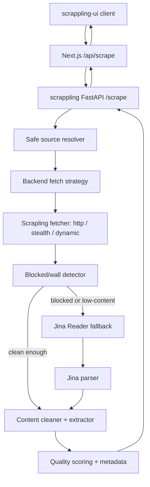

# Backend Jina Fallback and Filter Wall Plan

Date: 2026-05-18

## Summary

Move the Jina Reader fallback out of `scrappling-ui` and into the `scrappling`
FastAPI backend. Keep the frontend as a thin display client. Add a backend
content-cleaning pipeline that detects blocked/login/subscribe/cookie wall text,
removes overlay noise from public/free content, and returns metadata that makes
scrape quality explicit.

This plan is scoped to public and freely accessible pages. The scraper should
detect auth walls, paywalls, and subscription gates, label the result as blocked
or partial, and avoid treating access-control text as useful page content.

## Current Evidence

### Backend: `/Users/raunaksingh/Documents/scrappling`

- `app/main.py` exposes `POST /scrape`.
- The request shape is selector-first: `url`, `fetcher`, `css`, `xpath`,
  `return_html`, `timeout`, `headless`, `network_idle`, and `user_agent`.
- Supported backend fetchers are currently `http`, `stealth`, and `dynamic`.
- The backend returns `{ url, status, fetcher, results, html }`.
- The backend does not currently call Jina Reader or return rich article fields
  like `text`, `markdown`, `links`, `images`, or quality metadata.
- `requirements.txt` currently includes FastAPI, Uvicorn, and
  `scrapling[fetchers]`.

### Frontend: `/Users/raunaksingh/Documents/scrappling-ui`

- `app/api/scrape/route.ts` currently calls the backend first, then calls Jina
  when `looksBlocked(result)` returns true.
- `lib/scrape-client.ts` owns:
  - blocked-page heuristics,
  - `scrapeViaJina()`,
  - markdown parsing from Jina Reader output,
  - conversion of backend HTML into the frontend `ScrapeResult`.
- `lib/enrich.ts` owns HTML cleanup, text extraction, markdown conversion, link
  extraction, and image extraction in TypeScript.
- `lib/types.ts` defines the frontend result union and already includes
  `"JinaReader"` as a fetcher.

## External References Checked

- Jina Reader API: `https://r.jina.ai` converts a URL into LLM-friendly text and
  supports unauthenticated and API-key usage with current rate tiers listed on
  the official Reader page.
  Source: https://jina.ai/en-US/reader/
- Scrapling docs confirm the shared import path for `Fetcher`,
  `StealthyFetcher`, and `DynamicFetcher`, and the existing backend already uses
  those classes.
  Source: https://scrapling.readthedocs.io/en/latest/fetching/choosing.html
- Scrapling docs describe `StealthyFetcher` as a browser-based fetcher for
  dynamic/protected sites. Use it as a normal rendering/fetching tool, not as a
  plan to bypass auth, paywalls, or site access controls.
  Source: https://scrapling.readthedocs.io/en/latest/fetching/stealthy.html
- Trafilatura supports Python-side main-text extraction, metadata extraction,
  markdown output, precision/recall controls, and XPath pruning for noisy
  blocks.
  Source: https://trafilatura.readthedocs.io/en/latest/usage-python.html
- `readability-lxml` is a smaller Python article extraction fallback that can
  extract and clean the main body text/title from HTML.
  Source: https://pypi.org/project/readability-lxml/
- Medium RSS feeds are officially available for profiles, publications, custom
  domains, publication tags, and topics. Medium explicitly says paywalled
  stories are not available as full stories in RSS feeds, so RSS is useful for
  public/free discovery and metadata, not paywall recovery.
  Source: https://help.medium.com/hc/en-us/articles/214874118-Using-RSS-feeds-of-profiles-publications-and-topics
- Medium membership is the official way to access the full member-only library,
  with no paywalls or story limits for paying members.
  Source: https://help.medium.com/hc/en-us/articles/115004545567-Become-a-Medium-Member

## Non-Goals and Safety Boundaries

- Do not implement paywall bypass.
- Do not implement login bypass.
- Do not rewrite Medium URLs to Freedium, 12ft-style mirrors, archive mirrors,
  cache mirrors, or other endpoints whose purpose is to bypass Medium's
  member-only access model.
- Do not automate credentialed access without explicit user-owned credentials
  and a separate product decision.
- Do not add proxy rotation, CAPTCHA solving, account farming, fingerprint
  evasion recipes, or other bot-detection circumvention workflows.
- Do detect these walls and return honest metadata: `blocked`, `partial`, or
  `fallback_used`.

## Target Architecture



The backend becomes the single source of truth for scraping strategy. The
frontend should no longer know whether Scrapling, Jina, or a safe public-source
resolver was used.

## API Design

### Add backend request fields

Keep existing selector mode intact, then add optional richer scraping controls:

```json
{
  "url": "https://example.com/article",
  "fetcher": "auto",
  "css": null,
  "xpath": null,
  "return_html": false,
  "return_content": true,
  "fallback": "jina_on_block",
  "clean": true,
  "content_mode": "article",
  "source_resolution": "safe_public",
  "headless": true,
  "network_idle": false,
  "timeout": 30
}
```

Recommended field meanings:

- `fetcher`: extend to `"auto" | "http" | "stealth" | "dynamic" | "jina"`.
- `return_content`: include normalized `text`, `markdown`, links, and images.
- `fallback`: `"none" | "jina_on_block" | "jina_on_empty" | "jina_always"`.
- `clean`: run the content filter wall and boilerplate cleaner.
- `content_mode`: `"raw" | "article" | "readable"`.
- `source_resolution`: `"none" | "safe_public"`. This may discover official
  public feeds, canonical URLs, author/publication metadata, and original-source
  links, but must not use paywall mirrors.

### Add backend response fields

Extend the existing response without breaking selector use:

```json
{
  "url": "https://example.com/article",
  "final_url": "https://example.com/article",
  "status": 200,
  "fetcher": "auto",
  "primary_fetcher": "stealth",
  "final_fetcher": "jina",
  "fallback_used": true,
  "blocked_detected": true,
  "content_status": "partial",
  "source_resolution": {
    "original_url": "https://example.com/article",
    "resolved_url": "https://example.com/article",
    "provider": "original",
    "attempted": ["original", "jina_original", "medium_rss_metadata"],
    "rejected": [
      {
        "provider": "freedium_mirror",
        "reason": "paywall_mirror_not_allowed"
      }
    ]
  },
  "quality": {
    "text_chars": 8120,
    "markdown_chars": 9140,
    "removed_noise_blocks": 7,
    "wall_score": 0.31,
    "confidence": 0.76
  },
  "results": {
    "css": {},
    "xpath": {}
  },
  "content": {
    "title": "Article title",
    "description": null,
    "text": "Cleaned readable text...",
    "markdown": "# Article title\n\nCleaned markdown...",
    "links": [],
    "images": []
  },
  "html": null
}
```

`content_status` should be one of:

- `full`: main content is likely available.
- `partial`: useful content exists but wall/noise/low confidence was detected.
- `blocked`: the page appears to be auth/paywall/subscription gated and no safe
  public article content was recovered.
- `empty`: fetch succeeded but no meaningful content was found.

## Backend Implementation Plan

### Phase 1: Move Jina into the backend

1. Add dependencies:
   - `httpx` for backend HTTP calls to Jina.
   - Optional later: `trafilatura` for main-content extraction.
2. Add `app/jina_reader.py`.
   - Build endpoint as `https://r.jina.ai/{url}`.
   - Send `Accept: text/plain`.
   - Use `JINA_API_KEY` from env when present.
   - Apply a backend timeout below the Boltic request timeout.
   - Parse Jina headers:
     - `Title: ...`
     - `URL Source: ...`
     - `Markdown Content:`
3. Add `"jina"` and `"auto"` to backend fetcher typing.
4. Add backend fallback logic:
   - fetch with the requested or default Scrapling fetcher,
   - convert to preliminary content,
   - run blocked/wall detection,
   - call Jina only when configured and detection indicates block/empty/low
     content,
   - keep the original Scrapling result as fallback evidence if Jina fails.
5. Add response metadata showing which fetcher actually won.

### Phase 2: Safe source resolver

Add `app/source_resolver.py` so site-specific "magic" lives in one explicit
policy layer instead of scattered URL rewrites.

#### Medium resolver behavior

For Medium URLs such as:

```text
https://medium.com/ux-planet/mcp-is-dead-cf16b667ba6d
```

Do not convert to:

```text
https://freedium-mirror.cfd/https://medium.com/ux-planet/mcp-is-dead-cf16b667ba6d
```

That pattern is a paywall mirror rewrite and is outside this plan.

Instead, the resolver should try safe public paths:

1. Scrape the original Medium URL.
2. If the original URL is blocked/empty, call Jina Reader on the original URL,
   not a mirror URL.
3. If the URL identifies a publication or author, derive Medium's official RSS
   feed URL and use it only for public/free discovery or metadata:
   - publication: `https://medium.com/feed/<publication>`
   - author: `https://medium.com/feed/@<username>`
   - custom domain: `https://<domain>/feed`
4. Match the article slug or canonical URL from the feed when present.
5. If RSS only provides an excerpt or excludes the full story, keep
   `content_status="partial"` or `content_status="blocked"` rather than
   pretending full content was recovered.
6. Detect member-only/paywall language and return honest metadata.

#### Legitimate "magic" alternatives

The resolver can feel polished without bypass mirrors by trying these in order:

- Original URL with Scrapling.
- Original URL with Jina Reader.
- Canonical URL from the original HTML if it points to the same public story.
- `rel=alternate` RSS/Atom feed if discovered in the page head.
- Medium official RSS feed for public/free profile or publication discovery.
- Author-owned canonical source when explicitly linked in page metadata or RSS.
- Structured metadata fallback: Open Graph, Twitter card, title, description,
  and preview image when full content is unavailable.

Do not add generic "free mirror" providers. If a provider's core behavior is to
unlock member-only or paid content without authorization, reject it in the
resolver policy and record the rejection reason in debug metadata.

### Phase 3: Backend content normalization

1. Add `app/content.py`.
2. Extract content from either:
   - Scrapling HTML,
   - Jina markdown,
   - selector results for old clients.
3. Preserve current selector output.
4. Normalize all rich output into one internal object:

```python
ContentResult = {
    "title": str | None,
    "description": str | None,
    "text": str,
    "markdown": str,
    "links": list[dict],
    "images": list[dict],
}
```

5. Use a conservative first version:
   - HTML: remove script/style/noscript/iframe/svg/head.
   - Extract title/meta description.
   - Extract body text.
   - Extract links/images with caps.
   - Markdown: use `markdownify` or Trafilatura markdown output.
6. Add Trafilatura after the baseline passes:
   - `extract(html, url=url, output_format="markdown", include_comments=False,
     include_tables=False, favor_precision=True)`.
   - Use `prune_xpath` for known overlay containers if needed.

### Phase 4: Filter wall

Build the filter wall as a scoring system, not a single regex delete pass.

#### Wall categories

- Auth/login:
  - `sign in`, `log in`, `create account`, `continue with Google`,
    `already a member`.
- Subscribe/paywall:
  - `subscribe`, `upgrade`, `premium`, `member-only`, `unlimited access`,
    `start your free trial`.
- Cookie/privacy:
  - `accept cookies`, `manage preferences`, `privacy choices`, `consent`.
- App/install:
  - `open in app`, `download our app`, `continue in app`.
- Bot/checkpoint:
  - `are you human`, `verify you are`, `access denied`, `request blocked`,
    `enable javascript and cookies`.
- Newsletter/marketing:
  - `sign up for our newsletter`, `get updates`, `enter your email`.

#### HTML-level removal

Remove nodes when both selector hints and text hints agree:

- `id/class/role` contains:
  - `modal`, `overlay`, `paywall`, `subscribe`, `newsletter`, `login`,
    `signin`, `signup`, `cookie`, `consent`, `gdpr`, `banner`, `interstitial`.
- Node text matches wall vocabulary.
- Node has high link/button density and low paragraph density.
- Node is structurally outside likely article containers.

#### Text/markdown-level removal

For Jina markdown, HTML structure is gone, so use block-level filtering:

1. Split markdown into blocks by blank lines.
2. Score each block:
   - wall phrase hits,
   - short CTA-like block,
   - high link density,
   - repeated navigation tokens,
   - no sentence-like body text.
3. Drop blocks over threshold.
4. Preserve blocks that look like article body:
   - long sentence density,
   - paragraphs with punctuation,
   - headings followed by body,
   - code/list/table content when not wall-like.
5. Return `removed_noise_blocks` and examples in debug mode only.

#### Important guardrail

Filtering should remove wall text from final context. It should not claim the
underlying gated article was recovered if it was not publicly available.

### Phase 5: Frontend simplification

1. Update `scrappling-ui/app/api/scrape/route.ts`.
   - Keep URL validation.
   - Always call backend `/scrape`.
   - Request `fetcher: "auto"`, `return_content: true`, `clean: true`,
     `fallback: "jina_on_block"`.
   - Remove frontend Jina fallback.
2. Update `scrappling-ui/lib/scrape-client.ts`.
   - Delete or deprecate `scrapeViaJina`.
   - Delete or deprecate frontend `looksBlocked`.
   - Convert backend rich response into existing `ScrapeResult`.
3. Update `scrappling-ui/lib/types.ts`.
   - Add backend metadata fields if the UI should display them.
4. Optional UI improvement:
   - Show a small badge like `Scrapling`, `Jina fallback`, `Partial`, or
     `Blocked`.

## Test Plan

### Backend unit tests

Add `pytest` tests with local fixtures:

- `clean_article.html`: content should pass with `content_status=full`.
- `login_overlay.html`: overlay block removed, article body preserved.
- `subscribe_overlay.html`: subscribe block removed, article body preserved.
- `cookie_banner.html`: cookie block removed.
- `checkpoint.html`: detected as `blocked`.
- `jina_with_wall.md`: wall blocks removed from markdown, article blocks kept.
- `wall_only.md`: detected as `blocked` or `empty`, not `full`.
- `medium_member_only.html`: detected as `blocked`, no mirror rewrite.
- `medium_public_rss.xml`: public RSS metadata can enrich a public result.
- `medium_rss_excerpt_only.xml`: excerpt-only feed returns `partial`, not
  `full`.

### Backend integration tests

Mock Jina with `respx` or a local FastAPI test route:

- Scrapling blocked + Jina success → `fallback_used=true`.
- Scrapling success → Jina is not called.
- Scrapling blocked + Jina fails → original blocked state is returned with
  useful error metadata.
- Medium URL + Freedium-like mirror config → resolver rejects provider with
  `reason="paywall_mirror_not_allowed"`.

### Frontend tests

Run:

```bash
cd /Users/raunaksingh/Documents/scrappling-ui
npm run typecheck
npm run build
```

Manual smoke:

- Paste a normal article URL.
- Paste a page with a cookie/newsletter overlay.
- Paste a known blocked/free page.
- Confirm UI displays final text/markdown and metadata without frontend Jina
  code.

### Backend checks

Run:

```bash
cd /Users/raunaksingh/Documents/scrappling
python -m pytest
docker build -t scrappling .
docker run --rm -p 8080:8080 scrappling
curl -s http://localhost:8080/health
```

## Suggested File Layout

Backend:

```text
app/main.py
app/models.py
app/fetchers.py
app/source_resolver.py
app/jina_reader.py
app/content.py
app/filter_wall.py
tests/fixtures/*.html
tests/fixtures/*.md
tests/test_filter_wall.py
tests/test_source_resolver.py
tests/test_jina_reader.py
tests/test_scrape_auto.py
```

Frontend:

```text
app/api/scrape/route.ts
lib/scrape-client.ts
lib/types.ts
components/ResultPanel.tsx
```

## Rollout Order

1. Add backend models without changing current behavior.
2. Add Jina backend client behind explicit `fetcher: "jina"`.
3. Add safe source resolver with Medium public-source handling.
4. Add content normalization.
5. Add filter wall and tests.
6. Add `fetcher: "auto"` and fallback policy.
7. Update frontend to call backend auto mode.
8. Remove frontend Jina fallback after backend behavior is verified.
9. Update both READMEs.

## Open Decisions

1. Should backend rich content be added to the existing `/scrape` endpoint or a
   new `/read` endpoint?
   - Recommendation: keep `/scrape` and extend it, because the frontend already
     points there.
2. Should Trafilatura be added immediately?
   - Recommendation: yes, but only after a baseline filter-wall test harness
     exists, so dependency behavior is measurable.
3. Should the UI display `content_status` and `fallback_used`?
   - Recommendation: yes. This makes partial/blocked output honest and easier
     to debug.
4. Should failed blocked pages return HTTP 200 or 4xx?
   - Recommendation: keep HTTP 200 with structured `content_status=blocked`,
     matching the current frontend discriminated-union pattern.
5. Should Medium-specific behavior be enabled by default?
   - Recommendation: enable only the safe public resolver by default. Keep any
     site-specific provider allowlist explicit in backend config.

## Definition of Done

- Backend can call Jina directly with optional `JINA_API_KEY`.
- Frontend no longer contains Jina fallback logic.
- Backend `auto` mode performs Scrapling first and Jina fallback only when
  configured detection says the Scrapling result is blocked/empty/low-quality.
- Medium URLs are handled by a safe resolver that tries original/Jina/RSS/public
  metadata paths and explicitly rejects Freedium-style paywall mirrors.
- Filter wall removes auth/subscribe/cookie/newsletter/app-install wall text
  from returned `text` and `markdown`.
- Response includes fetcher/fallback/content-status/quality metadata.
- Selector-based scraping still works for old callers.
- Fixture tests prove the cleaner keeps article content and removes wall noise.
- READMEs document env vars, fallback behavior, and the public/free-content
  boundary.
